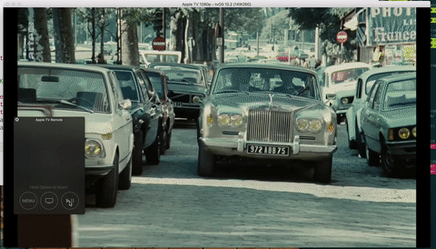

# Radar-31271447

AVPlayerViewController: Scrubbing to the very beginning of a live event stream seeks a not longer seekable position

· Open radar: https://openradar.appspot.com/31271447

# Description
When scrubbing to the very beginning of a live event stream, AVPlayerViewController tries to seek a non seekable position.



# Steps
In this repo you can find a projects playing a live stream.

Scrubbing to the very begining fails. The result is seeking back to live or in case of waiting for a longer time getting a frozen player.

You will get a trace "Seeking a not longer seekable position" in the console coming from the following code in ViewController.swift which probes that the targetTime is lower than the first seekable time.

```swift
    func playerViewController(_ playerViewController: AVPlayerViewController, timeToSeekAfterUserNavigatedFrom oldTime: CMTime, to targetTime: CMTime) -> CMTime {

        if let firstSeekableRange = playerViewController.player?.currentItem?.seekableTimeRanges.first?.timeRangeValue {

            if targetTime < firstSeekableRange.start {
                print("Seeking a not longer seekable position")
            }
        }

        return targetTime
    }
```

# Expected
Scrubbing to the very beginning plays the content from the begining of the available window

# Version:
tvOS 10.2
